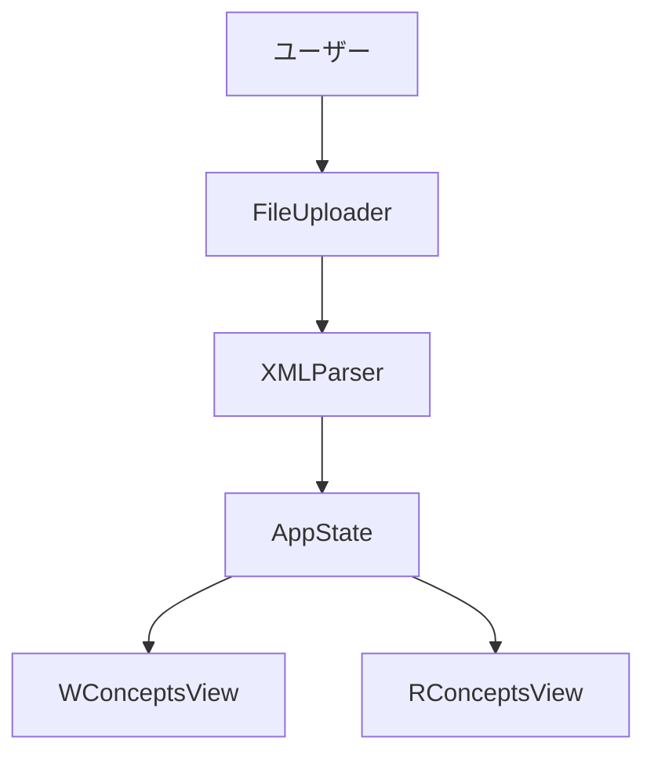

# Ontology Viewer

チームのための**ブラウザ完結・インストール不要**のオントロジービューワー。OE形式のXMLをドラッグ&ドロップするだけで、概念の階層（ISAツリー）と制約関係グラフを切り替えて閲覧できます。

[License: MIT](LICENSE)

## コンセプト

- **ゼロフリクション閲覧**: サーバーや `npm install` なし。HTML を開いて XML を読み込むだけで閲覧（設計上の標準構成はリポジトリルートの `index.html` と `src/`）。
- **2ビューで理解支援**: **W_CONCEPTS**（ISA継承ツリー）と **R_CONCEPTS**（制約関係グラフ）をワンクリックで切り替え、マクロとミクロの両方から把握。
- **非専門家ファースト**: OWL/XML の知識がなくても、マニュアルなしで基本操作できる UI を目指します。

詳細な要求・非機能要件は [プロダクト要求定義書](docs/product-requirements.md) を参照してください。

## リポジトリの現状（実装との関係）

本リポジトリには永続ドキュメント（`docs/`）が含まれます。動作確認用に同梱するオントロジーのサンプルファイルはありません。**手元のOE形式XML**で確認してください。

アプリ本体の標準構成（`index.html`、`src/` 以下のバニラ JS/CSS）は [リポジトリ構造定義書](docs/repository-structure.md) に定義されています。**クイックスタート**は、その構成がリポジトリに揃った状態—または同等の配布物—を前提とします。

## クイックスタート（エンドユーザー）

1. リポジトリルートの `**index.html`** を Chromium 系ブラウザ（Chrome / Edge 最新版推奨）で開く。
2. OE形式の **XML ファイル**をドラッグ&ドロップする（またはファイル選択ダイアログから選択）。
3. **W_CONCEPTS / R_CONCEPTS** を切り替え、ノードをクリックしてサイドパネルで詳細を確認する。

手動テストのシナリオ例は [開発ガイドライン](docs/development-guidelines.md) の「手動テスト（初期フェーズ）」にあります。その際は適宜OE形式XMLを用意して実行してください。

## 技術スタック（概要）


| 分類    | 採用                                                                                          |
| ----- | ------------------------------------------------------------------------------------------- |
| アプリ構成 | HTML5 / CSS3 / Vanilla JavaScript（ES2020+）、ビルドツールなし                                         |
| グラフ   | [Cytoscape.js](https://js.cytoscape.org/)（CDN）                                              |
| レイアウト | [cytoscape-elk](https://github.com/cytoscape/cytoscape.js-elk)（CDN、ISA ツリーには ELK LAYERED 等） |


CDN のバージョン固定方針などは [技術仕様書](docs/architecture.md) を参照してください。

## 新規開発者向け：環境・着手手順

### 前提


| 項目   | 内容                                                                                                      |
| ---- | ------------------------------------------------------------------------------------------------------- |
| エディタ | VS Code など                                                                                              |
| ブラウザ | **Chrome / Edge** 最新版（初期スコープは Chromium 系。Firefox / Safari は [PRD](docs/product-requirements.md) 上スコープ外） |


### リポジトリの取得と起動

```bash
git clone <このリポジトリのURL>
cd ontology_viewer
```

標準構成では **`index.html` をブラウザで直接開く**だけで起動します（アプリ実行自体に `npm install` は不要）。

- **Linux（例）**: `xdg-open index.html`
- **macOS**: `open index.html`
- **Windows**: `start index.html`

### 任意：ローカル HTTP サーバー

`file://` でモジュールや CORS 周りが困る場合のみ、軽量サーバーを利用します。

```bash
python3 -m http.server 8080
# ブラウザで http://localhost:8080 を開く
```

### 開発者向け：ESLint セットアップ

コード品質チェックを行う場合のみ、Node.js 環境で ESLint を利用します。

```bash
npm install
npm run lint
```

- 自動修正を適用する場合: `npm run lint:fix`
- 設定ファイル: `.eslintrc.json`
- 対象: `src/**/*.js` とリポジトリ直下の `*.js`

### 設計を読む順番（おすすめ）

1. [プロダクト要求定義書](docs/product-requirements.md) — 何を作るか
2. [機能設計書](docs/functional-design.md) — 画面・データ・フロー
3. [技術仕様書](docs/architecture.md) — スタック・制約・セキュリティ
4. [リポジトリ構造定義書](docs/repository-structure.md) — 配置ルール・依存の向き
5. [開発ガイドライン](docs/development-guidelines.md) — コーディング・Git・テスト
6. [用語集](docs/glossary.md) — ユビキタス言語

作業単位のメモは `.steering/[YYYYMMDD]-[task-name]/` に置く運用です（詳細は [リポジトリ構造定義書](docs/repository-structure.md)）。

## アーキテクチャ概要

サーバーなしのシングルページアプリとして、UI（コンポーネント）／ロジック（パース・グラフ構築）／状態（`AppState`）／描画ビューを分離する方針です。詳細なレイヤー図は [技術仕様書](docs/architecture.md) を参照してください。




（図は [機能設計書](docs/functional-design.md) の構成に沿った概念図です。クラス名は実装ファイル名に対応）

## ドキュメント一覧


| ドキュメント                                                      | 内容             |
| ----------------------------------------------------------- | -------------- |
| [product-requirements.md](docs/product-requirements.md)     | PRD・KPI・受け入れ条件 |
| [functional-design.md](docs/functional-design.md)           | 機能設計・データモデル    |
| [architecture.md](docs/architecture.md)                     | 技術仕様・性能・セキュリティ |
| [repository-structure.md](docs/repository-structure.md)     | ディレクトリ規約       |
| [development-guidelines.md](docs/development-guidelines.md) | 開発規約・手動テスト     |
| [glossary.md](docs/glossary.md)                             | 用語集            |


## セキュリティ・プライバシー（設計上の前提）

- **ローカル処理**: アップロードした XML は**外部サーバーに送信・保存しない**方針です（ブラウザ内で完結）。
- **XSS 対策**: オントロジー由来のテキストは **`textContent` / `createTextNode`** で挿入し、`innerHTML` への直接代入を禁止しています（[開発ガイドライン](docs/development-guidelines.md)）。
- **外部通信**: CDN からグラフライブラリを読み込む際にネットワークが必要です。オフライン要件がある場合は [技術仕様書](docs/architecture.md) の方針に従いローカル同梱を検討してください。

## 対応環境・スコープ外（要約）

- **対応**: デスクトップ、Chromium 系ブラウザで `index.html` 直開き（またはローカルサーバー）。
- **スコープ外（初期）**: オントロジー編集、Firefox/Safari、モバイル最適化、認証・アカウント管理等。詳細は [PRD のスコープ外](docs/product-requirements.md#スコープ外)。

## ロードマップ上の機能（参考）

検索・エッジフィルタ、循環ISA検出、外部URL読み込み、Web Worker による大規模ファイル処理などは PRD 上 **P1 / P2** として位置づけられています。実装状況はコードと Issue / PR を参照してください。

## ライセンス

[MIT License](LICENSE)

Copyright (c) 2025 Generative Agents

---

**Claude Code 向けメモ**: プロジェクト運用ルールは [CLAUDE.md](CLAUDE.md) を参照してください。