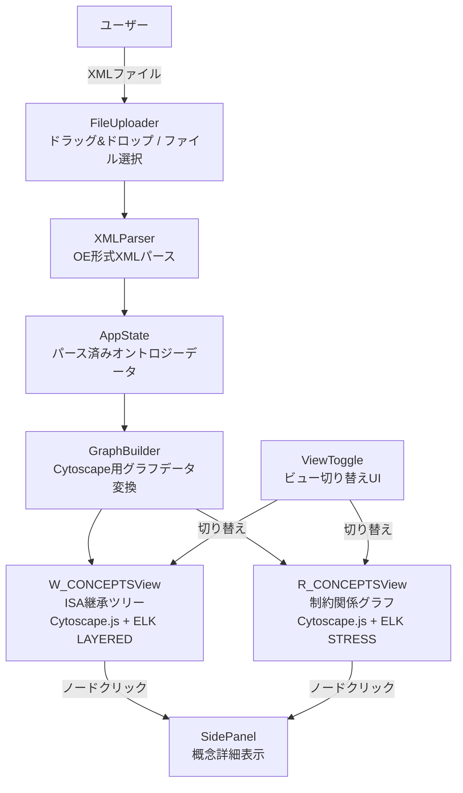
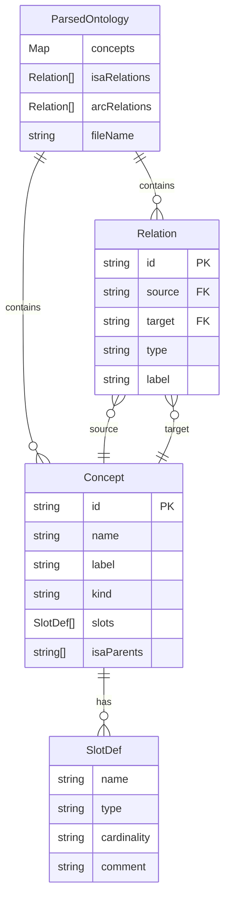
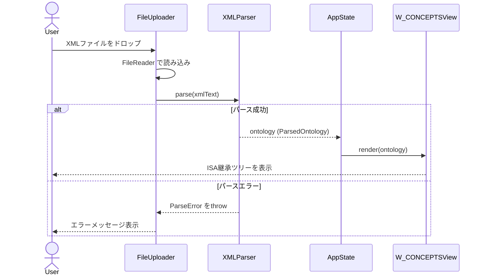
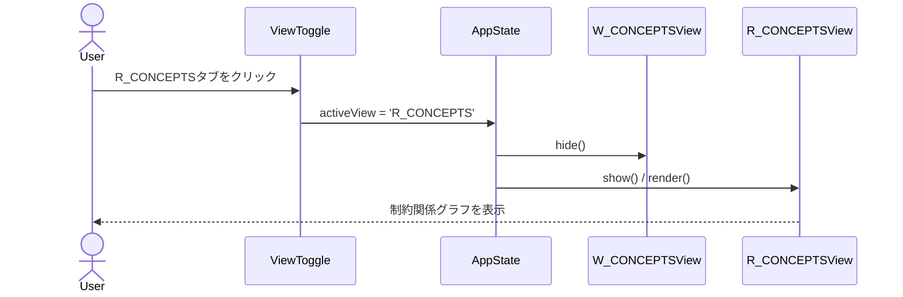
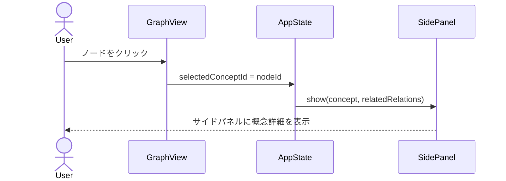
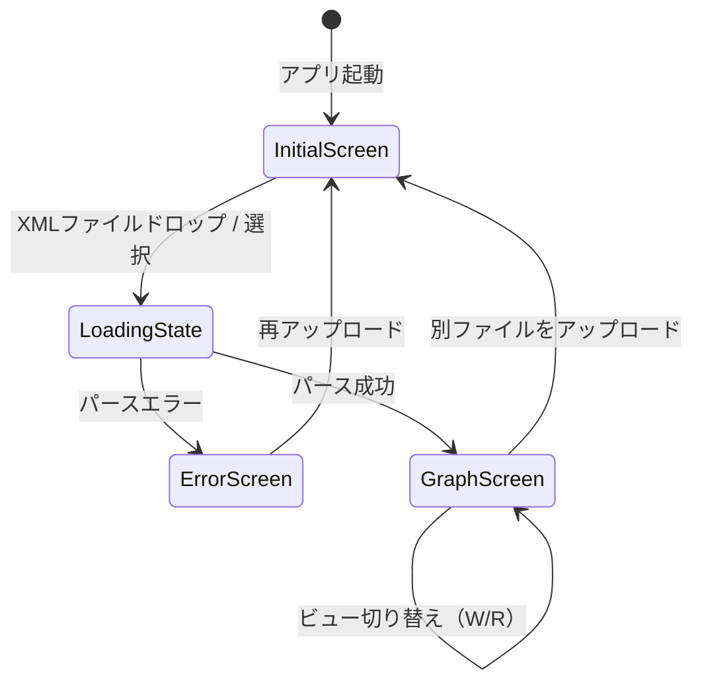

# 機能設計書 (Functional Design Document)

## システム構成図

本アプリケーションはサーバー不要のシングルページアプリケーション（バニラHTML/CSS/JS）として動作する。



## 技術スタック

| 分類 | 技術 | 選定理由 |
|------|------|----------|
| 言語 | HTML / CSS / Vanilla JS (ES2020+) | サーバー不要・インストール不要の要件を満たす |
| グラフ描画 | Cytoscape.js (CDN) | 大規模グラフの安定した描画・豊富なAPI |
| レイアウトエンジン | cytoscape-elk (CDN) | ISA継承ツリーのLAYEREDレイアウトに最適 |
| スタイリング | CSS Variables + flexbox | 依存ゼロで十分なUI構築が可能 |
| ビルドツール | なし | HTMLファイル直接実行のため不要 |

## データモデル定義

### エンティティ: Concept

オントロジー内の概念を表す基本エンティティ。W_CONCEPTS・R_CONCEPTSの両方から生成される。

```javascript
/**
 * @typedef {Object} Concept
 * @property {string} id           - XMLのID属性（例: "W_Human"）
 * @property {string} name         - 概念名（英語）
 * @property {string} [label]      - 日本語ラベル（存在する場合）
 * @property {'W'|'R'} kind        - W_CONCEPTS由来 or R_CONCEPTS由来
 * @property {SlotDef[]} slots     - スロット定義一覧
 * @property {string[]} isaParents - ISA親概念のID一覧（W_CONCEPTSのみ）
 */

/**
 * @typedef {Object} SlotDef
 * @property {string} name         - スロット名
 * @property {string} [type]       - スロットの値型
 * @property {string} [cardinality] - カーディナリティ（例: "1", "0..*"）
 * @property {string} [comment]    - 説明文
 */
```

### エンティティ: Relation

概念間の関係（ISA継承またはARC制約）を表す。

```javascript
/**
 * @typedef {Object} Relation
 * @property {string} id           - 関係のユニークID（生成）
 * @property {string} source       - 起点概念のID
 * @property {string} target       - 終点概念のID
 * @property {'ISA'|'ARC'} type   - 関係種別
 * @property {string} [label]      - エッジラベル（ARC種別名など）
 */
```

### エンティティ: ParsedOntology

XMLパース後のルートデータ構造。AppState に保持される。

```javascript
/**
 * @typedef {Object} ParsedOntology
 * @property {Map<string, Concept>} concepts   - 全概念（id → Concept）
 * @property {Relation[]} isaRelations         - ISA継承関係一覧
 * @property {Relation[]} arcRelations         - ARC制約関係一覧
 * @property {string} [fileName]               - 元ファイル名（表示用）
 */
```

### ER図



---

## コンポーネント設計

### FileUploader

**責務**: XMLファイルのアップロード受付（ドラッグ&ドロップ / ファイル選択ダイアログ）

```javascript
class FileUploader {
  // ドロップゾーンのDOM要素を初期化
  init(dropZoneEl, fileInputEl);

  // ファイル受付後にコールバックを呼び出す
  onFileSelected(callback /* (File) => void */);
}
```

**依存関係**: なし（ブラウザFile API のみ）

---

### XMLParser

**責務**: OE形式XMLをパースし `ParsedOntology` オブジェクトを生成する

```javascript
class XMLParser {
  // XMLテキストをパースしてParsedOntologyを返す
  // 不正フォーマット時は ParseError をthrow
  parse(xmlText /* string */); // => ParsedOntology

  // W_CONCEPTS要素からConcept一覧とISA関係を抽出
  _parseWConcepts(wConceptsEl); // => { concepts, isaRelations }

  // R_CONCEPTS要素からConcept一覧とARC関係を抽出
  _parseRConcepts(rConceptsEl); // => { concepts, arcRelations }
}
```

**依存関係**: ブラウザ標準 DOMParser API

---

### AppState

**責務**: アプリ全体の状態を一元管理する（シングルトン・オブザーバーパターン）

```javascript
// イベント名定数
const AppEvents = {
  ONTOLOGY_LOADED:  'ontologyLoaded',  // payload: ParsedOntology
  VIEW_CHANGED:     'viewChanged',     // payload: 'W_CONCEPTS' | 'R_CONCEPTS'
  CONCEPT_SELECTED: 'conceptSelected', // payload: string | null (conceptId)
};

class AppState {
  // 現在のオントロジーデータ（null = 未ロード）
  ontology; // ParsedOntology | null

  // 現在表示中のビュー
  activeView; // 'W_CONCEPTS' | 'R_CONCEPTS'

  // 選択中の概念ID
  selectedConceptId; // string | null

  // 状態変更時にリスナーを呼び出す
  subscribe(event /* AppEvents[keyof AppEvents] */, listener /* (payload) => void */);
  emit(event /* AppEvents[keyof AppEvents] */, payload);
}

// app.js にてモジュールスコープで唯一のインスタンスを生成し、各コンポーネントに注入する
// const appState = new AppState();
```

---

### GraphBuilder

**責務**: `ParsedOntology` を Cytoscape.js が受け付けるノード・エッジ形式に変換する

```javascript
class GraphBuilder {
  // ParsedOntologyからW_CONCEPTS用Cytoscapeグラフデータを生成する
  buildWGraph(ontology /* ParsedOntology */); // => { nodes: CyNode[], edges: CyEdge[] }

  // ParsedOntologyからR_CONCEPTS用Cytoscapeグラフデータを生成する
  buildRGraph(ontology /* ParsedOntology */); // => { nodes: CyNode[], edges: CyEdge[] }
}

/**
 * @typedef {{ data: { id: string, label: string, kind: 'W'|'R' } }} CyNode
 * @typedef {{ data: { id: string, source: string, target: string, type: 'ISA'|'ARC', label?: string } }} CyEdge
 */
```

**依存関係**: データのみ（DOM・Cytoscape APIに非依存）

---

### W_CONCEPTSView

**責務**: ISA継承ツリーをCytoscape.js + ELK LAYEREDレイアウトで描画する

```javascript
class WConceptsView {
  // コンテナ要素とCytoscape.jsインスタンスを初期化
  init(containerEl);

  // ParsedOntologyからグラフを構築・描画する
  render(ontology /* ParsedOntology */);

  // 全体を画面にフィットさせる
  fit();

  // グラフを破棄する
  destroy();
}
```

**レイアウト設定**:
```javascript
{
  name: 'elk',
  elk: {
    algorithm: 'layered',
    'elk.direction': 'DOWN',
    'elk.layered.spacing.nodeNodeBetweenLayers': 50,
    'elk.spacing.nodeNode': 20,
  }
}
```

**依存関係**: Cytoscape.js, cytoscape-elk

---

### R_CONCEPTSView

**責務**: 制約関係グラフをCytoscape.js + ELKレイアウトで描画する

```javascript
class RConceptsView {
  init(containerEl);
  render(ontology /* ParsedOntology */);
  fit();
  destroy();
}
```

**レイアウト設定**:
```javascript
{
  name: 'elk',
  elk: {
    algorithm: 'stress',
  }
}
```

**依存関係**: Cytoscape.js, cytoscape-elk

---

### SidePanel

**責務**: 選択された概念の詳細情報（ラベル・スロット・制約）をサイドパネルに表示する

```javascript
class SidePanel {
  init(panelEl);

  // 概念詳細を表示する（日本語ラベル優先）
  show(concept /* Concept */, relatedRelations /* Relation[] */);

  // パネルを閉じる
  hide();
}
```

---

### ViewToggle

**責務**: W_CONCEPTS / R_CONCEPTSのビュー切り替えUIを制御する

```javascript
class ViewToggle {
  init(toggleEl);

  // 切り替えイベントのコールバック登録
  onChange(callback /* ('W_CONCEPTS' | 'R_CONCEPTS') => void */);

  // 現在アクティブなビューを視覚的に反映する
  setActive(view /* 'W_CONCEPTS' | 'R_CONCEPTS' */);
}
```

---

## ユースケース図

### UC1: XMLファイルアップロード → グラフ表示



### UC2: ビュー切り替え



### UC3: ノードクリック → 詳細表示



---

## 画面遷移図



---

## UIレイアウト設計

### 全体レイアウト（デスクトップ）

```
┌─────────────────────────────────────────────────────────┐
│  Header: Ontology Viewer            [W_CONCEPTS | R_CONCEPTS] │
├──────────────────────────────────────┬──────────────────┤
│                                      │  SidePanel        │
│   Graph Area (Cytoscape.js)          │  ─────────────── │
│                                      │  概念名: Human    │
│   (ドラッグ&ドロップでファイルを       │  ラベル: 人間      │
│    アップロード / ズーム・パン対応)    │                  │
│                                      │  スロット:         │
│                                      │  - name: string   │
│                                      │  - age: int       │
│                                [Fit] │  ─────────────── │
└──────────────────────────────────────┴──────────────────┘
```

### 初期画面（ファイル未ロード時）

```
┌─────────────────────────────────────────────────────────┐
│  Header: Ontology Viewer                                 │
├──────────────────────────────────────────────────────────┤
│                                                          │
│           ┌────────────────────────────────┐            │
│           │   XMLファイルをドロップ          │            │
│           │         または                  │            │
│           │   [ファイルを選択]               │            │
│           └────────────────────────────────┘            │
│                                                          │
└──────────────────────────────────────────────────────────┘
```

### ノードスタイル

| 要素 | スタイル |
|------|---------|
| W_CONCEPTノード | 角丸長方形、背景 #4A90D9（青系） |
| R_CONCEPTノード | 角丸長方形、背景 #7CBF5E（緑系） |
| ISAエッジ | 実線矢印、灰色 |
| ARCエッジ | 実線矢印、オレンジ系、ラベル付き |
| 選択中ノード | ボーダー強調（黄色） |

---

## XMLパース設計

### OE形式XMLの構造（想定）

```xml
<ontology>
  <W_CONCEPTS>
    <concept id="W_Animal">
      <label lang="ja">動物</label>
      <slot name="weight" type="float"/>
      <isa parent="W_LivingThing"/>
    </concept>
    <concept id="W_Human">
      <label lang="ja">人間</label>
      <slot name="name" type="string"/>
      <isa parent="W_Animal"/>
    </concept>
  </W_CONCEPTS>

  <R_CONCEPTS>
    <concept id="R_Owns">
      <label lang="ja">所有する</label>
      <r_const id="RC_Owns">
        <arc from="W_Human" to="W_Item" label="所有者"/>
      </r_const>
    </concept>
  </R_CONCEPTS>
</ontology>
```

### パースアルゴリズム

```
1. DOMParser でXMLテキストをパース
2. <W_CONCEPTS> 内の各 <concept> を走査:
   a. id, name, label(lang="ja") を取得
   b. <slot> 要素からSlotDef一覧を生成
   c. <isa parent="..."> からisaParents配列を生成
   d. Concept オブジェクトを Map に追加
   e. ISA Relation を isaRelations に追加
3. <R_CONCEPTS> 内の各 <concept> を走査:
   a. id, name, label を取得
   b. <r_const> 内の <arc> からARC Relation を生成
   c. Concept オブジェクトを Map に追加
4. ParsedOntology を返す
```

---

## エラーハンドリング

### エラーの分類

| エラー種別 | 発生箇所 | 処理 | ユーザーへの表示 |
|-----------|---------|------|-----------------|
| 非XMLファイル | FileUploader | 処理中断 | 「XMLファイルを選択してください」 |
| 100MB超ファイル | FileUploader | アップロード中断 | 「ファイルサイズが大きすぎます（上限100MB）。別のファイルを選択してください」 |
| XMLパースエラー | XMLParser | ParseError throw | 「XMLの読み込みに失敗しました: (詳細)」 |
| 想定外のXML構造 | XMLParser | 空データで継続 | 「W_CONCEPTSまたはR_CONCEPTSが見つかりませんでした」 |
| グラフ描画失敗 | GraphView | コンソールエラー + UI通知 | 「グラフの表示に失敗しました」 |
| 循環ISA（P1） | XMLParser | 警告フラグを付与 | 「循環参照が検出されました: (概念名)」 |

---

## パフォーマンス最適化

- **初期表示**: ELKレイアウトはWeb Worker上で実行されるため、メインスレッドをブロックしない
- **大規模ファイル（P2）**: XMLパース処理をWeb Workerに分離し、UIのフリーズを防ぐ
- **不要な再レンダリング防止**: ビュー切り替え時は既存のCytoscapeインスタンスをshow/hideし、再描画を回避する

---

## セキュリティ考慮事項

- **XSS対策**: オントロジーファイルから取得したテキスト（ラベル・概念名）はすべて `textContent` または `createTextNode` でDOMに挿入し、`innerHTML` への直接代入は禁止
- **ローカル処理**: XMLファイルはブラウザ内のみで処理し、外部サーバーへの送信は一切行わない
- **Content Security Policy**: インラインスクリプト・外部フォント等の不要なリソースを制限する（CDNライブラリは明示的に許可）
