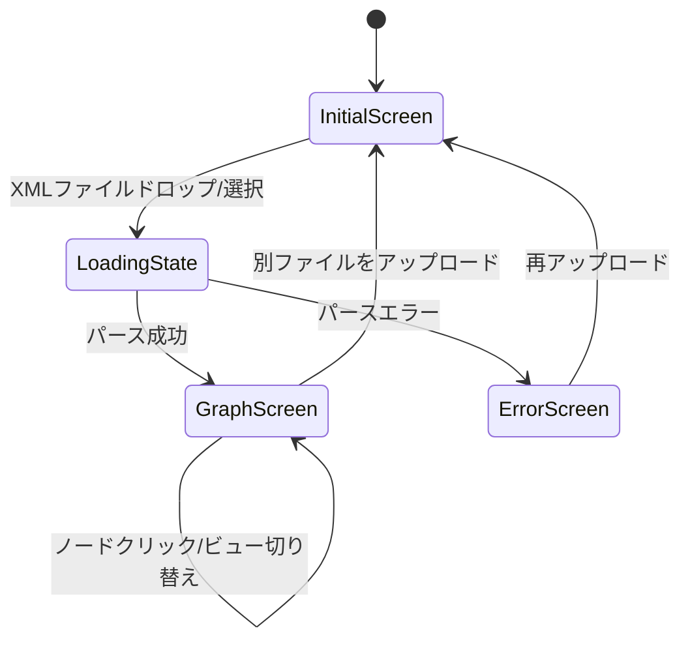

# プロジェクト用語集 (Glossary)

## 概要

このドキュメントは、Ontology Viewer プロジェクト内で使用される用語の定義を管理します。
ドメイン用語・技術用語・アーキテクチャ用語を統一的に定義し、チーム全体での認識を合わせる。

**更新日**: 2026-05-06

---

## ドメイン用語

オントロジーに関するビジネス・ドメイン概念の用語。

### オントロジー（Ontology）

**定義**: ある領域の概念、その属性、および概念間の関係を形式的に定義した知識表現。

**説明**: 本プロジェクトでは、OE（オントロジーエンジニアリング）形式のXMLファイルとして表現されるオントロジーを扱う。専門家が設計し、チームメンバーと共有するために使用する。

**関連用語**: 概念（Concept）、ISA関係、ARC関係、W_CONCEPTS、R_CONCEPTS

---

### 概念（Concept）

**定義**: オントロジーの基本単位。ある事物・クラスを表す名前付きエンティティ。

**説明**: OE形式XMLでは `<concept id="...">` 要素として表現される。日本語ラベル（`<label lang="ja">`）を持つ場合は日本語で表示する。

**英語表記**: Concept

**コード上の表現**: `Concept` オブジェクト（`id`, `name`, `label`, `kind`, `slots`, `isaParents` フィールドを持つ）

**関連用語**: W_CONCEPTS概念、R_CONCEPTS概念、スロット、ラベル

---

### W_CONCEPTS概念

**定義**: W_CONCEPTS（World Concepts）セクションに定義された概念。ISA継承階層を形成する。

**説明**: OE形式XMLの `<W_CONCEPTS>` 要素内に定義される。「クラス」に相当し、ISA関係で親子階層を構成する。スロット定義を持つ。

**英語表記**: W_CONCEPT

**コード上の表現**: `kind === 'W'` のConcept オブジェクト

**関連用語**: R_CONCEPTS概念、ISA関係、スロット

---

### R_CONCEPTS概念

**定義**: R_CONCEPTS（Relation Concepts）セクションに定義された概念。概念間の制約関係を表す。

**説明**: OE形式XMLの `<R_CONCEPTS>` 要素内に定義される。「関係クラス」に相当し、ARC（制約）を持つ。

**英語表記**: R_CONCEPT

**コード上の表現**: `kind === 'R'` のConcept オブジェクト

**関連用語**: W_CONCEPTS概念、ARC、R_CONST

---

### ISA関係

**定義**: 「is-a（〜は〜の一種）」を表す概念間の継承関係。

**説明**: `<isa parent="概念ID"/>` 要素で表現される。W_CONCEPTSビューではLAYEREDレイアウトで階層ツリーとして可視化する。循環ISA（A→B→A）は不正な状態。

**英語表記**: ISA Relation / Inheritance Relation

**コード上の表現**: `Relation` オブジェクト（`type === 'ISA'`）、`isaRelations` 配列に格納

**関連用語**: W_CONCEPTSビュー、ARC関係、循環ISA

**使用例**:
- 「犬」 ISA 「動物」（犬は動物の一種）
- `<isa parent="W_Animal"/>` で記述

---

### ARC関係

**定義**: R_CONCEPTS内のR_CONSTで定義された概念間の制約関係。

**説明**: `<arc from="概念ID" to="概念ID" label="ラベル"/>` 要素で表現される。R_CONCEPTSビューではグラフのエッジとして可視化する。

**英語表記**: ARC Relation / Constraint Relation

**コード上の表現**: `Relation` オブジェクト（`type === 'ARC'`）、`arcRelations` 配列に格納

**関連用語**: R_CONCEPTS概念、R_CONST

---

### R_CONST

**定義**: R_CONCEPTS内で概念間の制約を定義する要素。ARCの集合。

**説明**: OE形式XMLの `<r_const id="...">` 要素。内部に複数の `<arc>` を持つ。

**英語表記**: R_CONST (Relational Constraint)

**関連用語**: ARC関係、R_CONCEPTS概念

---

### スロット（Slot）

**定義**: 概念が持つ属性・プロパティの定義。

**説明**: `<slot name="..." type="..."/>` 要素で表現される。概念が持てる値の種類と制約を定義する。サイドパネルに表示される。

**英語表記**: Slot

**コード上の表現**: `SlotDef` オブジェクト（`name`, `type`, `cardinality`, `comment` フィールド）

**関連用語**: 概念、サイドパネル

---

### ラベル（Label）

**定義**: 概念に付けられた人間可読な名前。日本語を含む自然言語で記述される。

**説明**: `<label lang="ja">人間</label>` のように言語タグ付きで定義される。日本語ラベルが存在する場合は概念ID（英語）より優先して表示する。

**英語表記**: Label

**コード上の表現**: `Concept.label` フィールド（日本語ラベル）、`Concept.name` フィールド（英語名）

**関連用語**: 概念

---

### OE形式XML

**定義**: オントロジーエンジニアリングツールが出力するXML形式。本プロジェクトが対象とするファイル形式。

**説明**: `<ontology>` ルート要素の下に `<W_CONCEPTS>` と `<R_CONCEPTS>` を持つ構造。

**英語表記**: OE Format XML

**関連用語**: W_CONCEPTS概念、R_CONCEPTS概念

---

### 循環ISA

**定義**: ISA関係がループを形成している不正な状態。（例: AはBの一種、BはAの一種）

**説明**: 本来のISA階層ツリーでは存在してはならない。検出された場合は警告として表示する（P1機能）。

**英語表記**: Circular ISA / ISA Cycle

**関連用語**: ISA関係

---

## 技術用語

本プロジェクトで使用している技術・ライブラリに関する用語。

### Cytoscape.js

**定義**: JavaScriptで実装されたグラフ理論ライブラリ。ノードとエッジからなるグラフを描画・操作できる。

**本プロジェクトでの用途**: W_CONCEPTSビューおよびR_CONCEPTSビューのグラフ描画エンジン

**バージョン**: 3.x（CDN経由、固定バージョン指定）

**選定理由**: 大規模グラフの安定した描画、豊富なAPI、活発なメンテナンス。vis-network（Canvas日本語問題）・dagre-d3（メンテ停止）を比較検討の上で選定。

**関連用語**: cytoscape-elk、ノード（Cytoscapeノード）、エッジ（Cytoscapeエッジ）

---

### cytoscape-elk

**定義**: Cytoscape.js 用のELKレイアウトエンジンプラグイン。

**本プロジェクトでの用途**: W_CONCEPTSビューのLAYEREDレイアウト（ISA継承ツリーの自動配置）に使用

**バージョン**: 2.x（CDN経由、固定バージョン指定）

**関連用語**: ELK LAYEREDレイアウト、Cytoscape.js

---

### ELK LAYEREDレイアウト

**定義**: ELK（Eclipse Layout Kernel）が提供する階層グラフレイアウトアルゴリズム。

**説明**: 有向グラフをレイヤー（階層）に分割し、上位→下位に整列して表示する。ISA継承ツリーの表示に最適。

**英語表記**: ELK LAYERED Layout

**本プロジェクトでの用途**: W_CONCEPTSビューでのISA継承ツリーの自動レイアウト

**コード上の設定値**: `{ name: 'elk', elk: { algorithm: 'layered', 'elk.direction': 'DOWN' } }`

**関連用語**: cytoscape-elk、W_CONCEPTSビュー

---

### DOMParser

**定義**: ブラウザ標準WebAPI。XMLやHTMLテキストをDOMツリーにパースする。

**本プロジェクトでの用途**: `XMLParser.js` でのOE形式XMLパースに使用

**関連用語**: XMLParser、OE形式XML

---

## アーキテクチャ用語

システム設計・コンポーネントに関する用語。

### ParsedOntology

**定義**: OE形式XMLをパースした結果を格納するルートデータ構造。

**本プロジェクトでの適用**: `XMLParser.parse()` が返し、`AppState` に保持される

**関連コンポーネント**: `XMLParser.js`, `AppState.js`

**主要フィールド**:
- `concepts`: 全概念のMap（id → Concept）
- `isaRelations`: ISA関係の配列
- `arcRelations`: ARC関係の配列
- `fileName`: 元ファイル名（表示用）

---

### AppState

**定義**: アプリケーション全体の状態を一元管理するシングルトンオブジェクト。オブザーバーパターンで状態変化を通知する。

**本プロジェクトでの適用**: `src/js/state/AppState.js` に実装。全コンポーネントが参照する

**管理する状態**:
- `ontology`: 現在読み込まれているParsedOntology
- `activeView`: 表示中のビュー（`'W_CONCEPTS'` or `'R_CONCEPTS'`）
- `selectedConceptId`: 選択中の概念ID

**関連コンポーネント**: 全コンポーネント（`FileUploader`, `ViewToggle`, `SidePanel`, `WConceptsView`, `RConceptsView`）

---

### W_CONCEPTSビュー

**定義**: ISA継承ツリーを表示するビュー。ELK LAYEREDレイアウトで階層構造を描画する。

**本プロジェクトでの適用**: `src/js/views/WConceptsView.js` に実装

**関連用語**: W_CONCEPTS概念、ISA関係、ELK LAYEREDレイアウト、R_CONCEPTSビュー

---

### R_CONCEPTSビュー

**定義**: 制約関係グラフを表示するビュー。ARC関係をネットワーク図として描画する。

**本プロジェクトでの適用**: `src/js/views/RConceptsView.js` に実装

**関連用語**: R_CONCEPTS概念、ARC関係、W_CONCEPTSビュー

---

### サイドパネル（SidePanel）

**定義**: グラフ上でノードをクリックした際に右側に表示される概念詳細パネル。

**表示内容**: 概念名（日本語ラベル優先）・スロット定義一覧・ARC制約情報

**本プロジェクトでの適用**: `src/js/components/SidePanel.js` に実装

**関連用語**: 概念、スロット

---

### オブザーバーパターン（Observer Pattern）

**定義**: 状態変化を監視するオブジェクト（オブザーバー）が、対象（サブジェクト）に登録し、変化通知を受け取る設計パターン。

**本プロジェクトでの適用**: `AppState` がサブジェクトとして機能し、各ビュー・コンポーネントがオブザーバーとして登録する。`appState.subscribe(event, handler)` で登録し、状態変化時に自動通知される。

---

## ステータス・状態

### アプリケーション状態

| 状態名 | 意味 | 遷移条件 |
|-------|------|---------|
| InitialScreen（初期画面） | ファイル未ロード状態。ドロップゾーンを表示 | アプリ起動時 |
| LoadingState（ロード中） | XMLパース中の一時状態 | XMLファイルがドロップ/選択された |
| GraphScreen（グラフ表示） | グラフ描画済みの通常操作状態 | パース成功時 |
| ErrorScreen（エラー画面） | パースエラー発生状態。エラーメッセージを表示 | パース失敗時 |

**状態遷移図**:


### アクティブビュー

| 値 | 表示内容 |
|----|---------|
| `'W_CONCEPTS'` | ISA継承ツリー（W_CONCEPTSビュー） |
| `'R_CONCEPTS'` | 制約関係グラフ（R_CONCEPTSビュー） |

---

## エラー・例外

### ParseError

**クラス名**: `ParseError`

**発生条件**: OE形式XMLのパース処理に失敗した場合

**発生箇所**: `src/js/logic/XMLParser.js`

**対処方法**:
- ユーザー: 正しいOE形式XMLファイルを再アップロードする
- 開発者: `error.message` に詳細が含まれる。ブラウザコンソールで `error.cause` を確認

**使用例**:
```javascript
throw new ParseError('W_CONCEPTSまたはR_CONCEPTS要素が見つかりません', originalError);
```

---

## 英語・日本語対応表

| 日本語 | 英語 | コード上の識別子 |
|--------|------|----------------|
| オントロジー | Ontology | - |
| 概念 | Concept | `Concept` |
| 継承関係 | ISA Relation | `'ISA'` |
| 制約関係 | ARC Relation | `'ARC'` |
| スロット | Slot | `SlotDef` |
| ラベル | Label | `Concept.label` |
| ISA継承ツリービュー | W_CONCEPTS View | `WConceptsView` / `'W_CONCEPTS'` |
| 制約関係グラフビュー | R_CONCEPTS View | `RConceptsView` / `'R_CONCEPTS'` |
| サイドパネル | Side Panel | `SidePanel` |
| パース済みオントロジー | Parsed Ontology | `ParsedOntology` |
| アプリ状態 | Application State | `AppState` |
| 循環ISA | Circular ISA | - |
